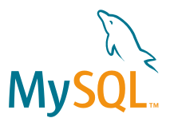

MySQL入门教程
--- 

  

从零开始学习MySQL，主要是面向MySQL数据库管理系统初学者。身为前端开发工程师为什么写这个破玩意儿呢，最近项目强迫我这个前端老司机使用MySQL，虽然我在项目中已经使用过一段时间，为了写出高质量的SQL语句，系统的过一遍基础，你也可以当做是我的笔记。周围人都在玩儿MySQL，有幸也认识一些玩儿 MySQL 的 DBA，所以我学习起来比较快，他们吹牛逼，说这玩意儿稳定、可靠、快速、管理方便以及夸平台等特点，大家还极力推荐我使用 MySQL，然后老板也要求我使用它，没办法我得好好玩儿。

原本我是使用 MongoDB 这种 NoSQL 数据库，Nodejs 在 Mongoose 的帮助下 JSON 数据直接插入 `MongoDB`中，对于一个前端开发工程师来说，使用起来非常舒服。但是没有办法，我是被逼的，从此入了一个新坑，我就决心系统的好好学习一下。如果你对本小电子书阅读非常没有耐心，你可以看看我做的一篇笔记 《[21分钟MySQL基础入门](21-minutes-MySQL-basic-entry.md)》 ，这个笔记还可以在 [SegmentFault](https://segmentfault.com/a/1190000006876419) 里面阅读，有导航阅读非常方便，为什么只需要21分钟呢？因为在我们大天朝有句话叫做三七二十一，你可以不管三七二十一开始使用 MySQL 及快速的方式入门 MySQL，里面系统的整理了一些常用的SQL语句。

在本书中所搜集到得各种资源，我将放到这里 [Awesome MySQL](awesome-mysql.md)。所有例子都是基于`MySQL 5.7.14` 运行的。这里面的一些理论知识都是从[维基百科](https://zh.wikipedia.org)等各种百科和各种官网搬运过来的，偶尔会有一些基础理论知识总结，如果有错误或者误差可以给我来个疯狂的[Pull requesets](https://github.com/jaywcjlove/mysql-tutorial/pulls)或者[Issue](https://github.com/jaywcjlove/mysql-tutorial/issues)。如果实在过意不去你可以🔫。

## 目录

#### 第1章 初识MySQL

- 1.1 [数据库基础](chapter1/1.1.md)
    - [什么是数据库](chapter1/1.1.md#什么是数据库)
    - [数据库分类](chapter1/1.1.md#数据库分类)
    - [数据库模型](chapter1/1.1.md#数据库模型)
    - [数据表](chapter1/1.1.md#数据表)
    - [关系键](chapter1/1.1.md#关系键)
- 1.2 [数据库技术构成](chapter1/1.2.md)
    - [数据库系统](chapter1/1.2.md#数据库系统)
    - [关系数据库基本概念](chapter1/1.2.md#关系数据库基本概念)
    - [SQL语言](chapter1/1.2.md#sql语言)
    - [数据库访问技术](chapter1/1.2.md#数据库访问技术)
- 1.3 [什么是MySQL](chapter1/1.3.md)
    - [MySQL介绍](chapter1/1.3.md#mysql-介绍)
    - [MySQL发展历史](chapter1/1.3.md#mysql-发展历史)
    - [MySQL版本](chapter1/1.3.md#mysql-版本)
    - [MySQL的优势](chapter1/1.3.md#mysql-的优势)
- 1.4 [MySQL工具](chapter1/1.4.md)
    - [命令行使用程序](chapter1/1.4.md#命令行使用程序)
    - [MySQL Workbench客户端](chapter1/1.4.md#mysql-workbench客户端)
    - [常用图形管理工具](chapter1/1.4.md#常用图形管理工具)
    - [mycli替代MySQL的mysql命令行工具](chapter1/1.4.md#mycli替代mysql的mysql命令行工具)
- 1.5 [如何学习MySQL](chapter1/1.5.md)

#### 第2章 MySQL的安装与配置

- 2.1 Mac平台下安装与配置MySQL5.7.14
- 2.2 linux平台下安装与配置MySQL5.7.14
- 2.2 启动服务并登录MySQL数据库
- 2.3 更改MySQL的配置

#### 第3章 数据库的基本操作

#### 第4章 数据表的基本操作

- 3.1 创建数据表

#### 第5章 数据类型和运算符

#### 第6章 MySQL函数

#### 第7章 查询数据

#### 第8章 插入、更新与删除数据

#### 第9章 索引

#### 第10章 存储过程和函数

#### 第11章 视图

#### 第12章 MySQL函数

#### 第13章 MySQL用户管理

#### 第14章 数据备份与还原

#### 第15章 MySQL日志

#### 第16章 性能优化

#### 第17章 各种问题解决

- 17.1 [让MySQL支持emoji图标存储](chapter17/1.1.md)
- 17.2 [Centos6下升级MySQL数据库](chapter17/1.2.md)
- 17.3 [Mac下重置MySQL的root密码](chapter17/1.3.md)

## 读者对象

适合下读者学习使用：

- MySQL 数据库初学者。
- 对数据库开发感兴趣，希望快速、全面掌握 MySQL 的人员。
- 对其他数据库有一定的了解，想转到 MySQL 平台使用它的开发者。
- 像我一样被逼无奈使用 MySQL 数据库的人。

整本书目录规划参考了其它几本 MySQL 书籍目录规划的，在我边学习边整理的过程可能有修改，这个过程有点慢，希望能完成。从目录来看，看上去内容丰富，比较完整的介绍了  MySQL  数据库技术的教程，我不是`DBA`，我不是，正在看这篇文章的你，很可能也不是，不想误人子弟，在项目中应用了一段时间 MySQL，如果你是`DBA`请多多指教，文采不佳还望高抬贵手，不甚感激，小弟在这里给您鞠躬。

我想念一个女孩儿，实属无奈我得继续努力，好好读书做个有趣的人，完成我的“著作”，待我著作完成可否跟我约个会？